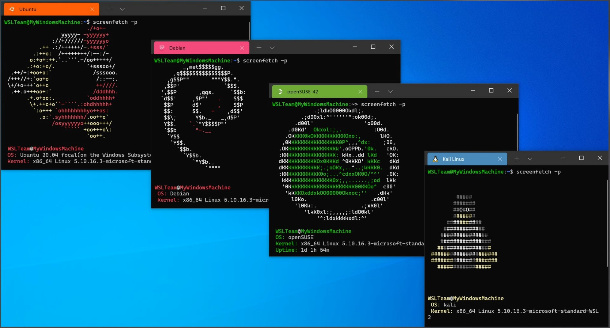

<!-- _backgroundColor: aquq -->

<!-- _color: orange -->

<!-- paginate: false -->

## Algoritma ve Programlama I

### Hafta-1

#### Linux için Windows Alt Sistemi nedir?

İndir [DOC](week-1.tr.md_doc.pdf), [SLIDE](week-1.tr.md_slide.pdf), [PPTX](week-1.tr.md_slide.pptx)

<iframe width=700, height=500 frameBorder=0 src="../week-1.tr.md_slide.html"></iframe>

---

<!-- paginate: true -->

### Anahat

- WSL 1 ve WSL 2'nin ne olduğunu öğrenin

---

## Linux için Windows Alt Sistemi nedir?

---

### WSL

- WSL nedir?
  Linux için Windows Alt Sistemi, geliştiricilerin bir GNU/Linux ortamını (çoğu komut satırı aracı, yardımcı program ve uygulama dahil) doğrudan Windows üzerinde, değiştirilmeden, geleneksel bir sanal makine veya çift önyükleme kurulumunun ek yükü olmadan çalıştırmasını sağlar.

---

---

### Neler yapabilirsin?

- Microsoft Store'dan favori GNU/Linux dağıtımlarınızı seçin.
- grep, sed, awk veya diğer ELF-64 ikili dosyaları gibi genel komut satırı araçlarını çalıştırın.
- Bash kabuk betiklerini ve aşağıdakileri içeren GNU/Linux komut satırı uygulamalarını çalıştırın:
  Araçlar: vim, emacs, tmux
  Diller: NodeJS, Javascript, Python, Ruby, C/C++, C# & F#, Rust, Go, vb.
  Hizmetler: SSHD, MySQL, Apache, lighttpd, MongoDB, PostgreSQL.
- Kendi GNU/Linux dağıtım paketi yöneticinizi kullanarak ek yazılım yükleyin.

---

- Unix benzeri bir komut satırı kabuğu kullanarak Windows uygulamalarını çağırın.
- Windows'ta GNU/Linux uygulamalarını çağırın.
- Doğrudan Windows masaüstünüze entegre edilmiş GNU/Linux grafik uygulamalarını çalıştırın
- Makine öğrenimi, veri bilimi senaryoları ve daha fazlası için GPU hızlandırmayı kullanın

---

### WSL'yi yükleyin

- https://learn.microsoft.com/en-us/windows/wsl/install

---

### WSL 2 nedir?

WSL 2, Linux için Windows Alt Sistemini Windows üzerinde ELF64 Linux ikili dosyalarını çalıştırmak üzere çalıştıran Linux için Windows Alt Sisteminin yeni bir sürümüdür. Birincil hedefleri, dosya sistemi performansını artırmanın yanı sıra tam sistem çağrısı uyumluluğu eklemektir.

Bu yeni mimari, bu Linux ikili dosyalarının Windows ve bilgisayarınızın donanımıyla nasıl etkileşime girdiğini değiştirir, ancak yine de WSL 1'deki (mevcut yaygın sürüm) ile aynı kullanıcı deneyimini sağlar.

Bireysel Linux dağıtımları, WSL 1 veya WSL 2 mimarisi ile çalıştırılabilir. Her dağıtım herhangi bir zamanda yükseltilebilir veya düşürülebilir ve WSL 1 ve WSL 2 dağıtımlarını yan yana çalıştırabilirsiniz. WSL 2, gerçek bir Linux çekirdeği çalıştırmanın avantajlarından yararlanan tamamen yeni bir mimari kullanır.

--- 

## Referanslar

- https://learn.microsoft.com/en-us/windows/wsl/about

---

$End-Of-Week-1-Module$
